
<b> Big Java</b>

<b>  Early Objects</b>

---

## **BAB 1**
### PENGANTAR

TUJUAN BAB
- Untuk belajar tentang komputer dan pemrograman
- Untuk mengkompilasi dan menjalankan yang pertama
Program Java
- Untuk mengenali waktu kompilasi dan
kesalahan run-time
- Untuk menggambarkan suatu algoritma dengan pseudocode

ISI BAB
---

**1.1 PROGRAM KOMPUTER 2**

**1.2 ANATOMI KOMPUTER 3**

C&S Komputer Ada Dimana-mana 5

**1.3 PEMROGRAMAN BAHASA JAVA
 5**

**1.4 MENJADI MAKSIMAL DENGAN ANDA
LINGKUNGAN PEMROGRAMAN 7**

PT 1 Salinan Cadangan 10

**1.5 MENGANALISIS PROGRAM PERTAMA ANDA
 11**

SYN Program Java 12

CE 1 Menghilangkan Titik Koma 13

**1.6 KESALAHAN 13**

E 2 Salah Eja Kata 14

**1.7 PEMECAHAN MASALAH:
DESAIN ALGORITMA 15**

HT 1 Mendeskripsikan Algoritma dengan
Pseudecode 18

WE 1 Menulis Algoritma untuk Pemasangan Lantai 20

---

**1.1 Program Komputer**

Anda mungkin pernah menggunakan komputer untuk bekerja atau bersenang-senang. Banyak orang menggunakan komputer untuk tugas sehari-hari seperti perbankan elektronik atau menulis makalah. Komputer adalah baik untuk tugas-tugas seperti itu. Mereka dapat menangani tugas yang berulang, seperti menjumlahkan angka atau menempatkan kata-kata di halaman, tanpa bosan atau lelah.

Fleksibilitas komputer adalah fenomena yang cukup menakjubkan. Mesin yang sama dapat menyeimbangkan buku cek Anda, menyusun makalah Anda, dan bermain game. Sebaliknya, mesin lain melakukan berbagai tugas yang jauh lebih sempit; sebuah mobil drive dan pemanggang roti bersulang. Komputer dapat melakukan berbagai tugas karena mereka mengeksekusi berbeda program, yang masing-masing mengarahkan komputer untuk mengerjakan tugas tertentu.

Komputer itu sendiri adalah mesin yang menyimpan data (angka, kata, gambar), berinteraksi dengan perangkat (monitor, sound system, printer), dan menjalankan program. Sebuah <b>program komputer</b> memberitahu komputer, secara rinci, urutan langkah-langkah yang: dibutuhkan untuk memenuhi suatu tugas. Komputer fisik dan perangkat periferal secara kolektif disebut <b>perangkat keras</b>. Program yang dijalankan komputer disebut <b>perangkat lunak</b>.

Program komputer saat ini sangat canggih sehingga sulit dipercaya bahwa mereka terdiri dari instruksi yang sangat primitif. Instruksi tipikal mungkin satu dari berikut ini:

* Letakkan titik merah pada posisi layar tertentu.
* Jumlahkan dua angka.
* Jika nilai ini negatif, lanjutkan program pada instruksi tertentu.

Pengguna komputer memiliki ilusi interaksi yang lancar karena sebuah program berisi sejumlah besar instruksi seperti itu, dan karena komputer dapat mengeksekusinya di kecepatan tinggi.

Tindakan merancang dan mengimplementasikan program komputer disebut <b>pemrograman</b>. Dalam buku ini, Anda akan mempelajari cara memprogram komputer—yaitu, cara mengarahkan
komputer untuk menjalankan tugas.

Untuk menulis game komputer dengan efek gerakan dan suara atau pengolah kata yang mendukung font dan gambar mewah adalah tugas kompleks yang membutuhkan tim yang terdiri dari banyak orang programmer yang sangat terampil. Upaya pemrograman pertama Anda akan lebih biasa. Konsep dan keterampilan yang Anda pelajari dalam buku ini membentuk landasan penting, dan
Anda tidak perlu kecewa jika program pertama Anda tidak menyaingi kecanggihannya perangkat lunak yang akrab bagi Anda. Sebenarnya, Anda akan menemukan bahwa ada sensasi yang luar biasa bahkan dalam tugas pemrograman sederhana. Sungguh pengalaman yang luar biasa melihat komputer tepat dan cepat melaksanakan tugas yang akan memakan waktu berjam-jam, untuk membuat perubahan kecil dalam program yang mengarah pada perbaikan segera, dan untuk melihat komputer menjadi perpanjangan dari kekuatan mental Anda.

---
**PERIKSA DIRI**

1. Apa yang diperlukan untuk memutar musik di komputer?
2. Mengapa pemutar CD kurang fleksibel dibandingkan komputer?
3. Apa yang perlu diketahui pengguna komputer tentang pemrograman agar dapat memainkan
video game?

---

## **1.2 Anatomi Komputer**

Untuk memahami proses pemrograman, Anda harus memiliki pemahaman dasar dari blok bangunan yang membentuk komputer. Kami akan melihat secara pribadi komputer. Komputer yang lebih besar memiliki komponen yang lebih cepat, lebih besar, atau lebih kuat, tetapi mereka pada dasarnya memiliki desain yang sama.

Di jantung komputer terletak <b>pusatnya unit pemrosesan (CPU)</b> (lihat Gambar 1). Bagian dalam pengkabelan CPU sangat rumit. Misalnya, prosesor Intel Core (yang populer CPU untuk per komputer pribadi pada saat ini tulisan) terdiri dari beberapa ratus juta elemen struktural, yang disebut <i>transistor</i>.

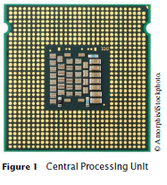

CPU melakukan kontrol program dan pengolahan data. Artinya, CPU menempatkan dan mengeksekusi instruksi program; itu melaksanakan operasi aritmatika seperti penjumlahan, pengurangan, perkalian, dan pembagian; itu mengambil data
dari memori eksternal atau perangkat dan tempat data yang telah diproses ke dalam penyimpanan.

Ada dua macam penyimpanan. Penyimpanan utama, atau memori, dibuat dari sirkuit elektronik yang dapat menyimpan data, asalkan: disuplai dengan tenaga listrik. **Penyimpanan sekunder**, biasanya **hard disk** (lihat Gambar 2) atau solid-state drive, menyediakan penyimpanan yang lebih lambat dan lebih murah yang bertahan tanpa

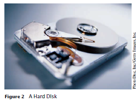

listrik. Sebuah hard disk terdiri dari piringan berputar, yang dilapisi dengan magnet bahan. Solid-state drive menggunakan komponen elektronik yang dapat menyimpan informasi tanpa daya, dan tanpa bagian yang bergerak.

Untuk berinteraksi dengan pengguna manusia, komputer membutuhkan perangkat periferal. Komputer mentransmisikan informasi (disebut <i>output</i>) kepada pengguna melalui layar tampilan, speaker, dan printer. Pengguna dapat memasukkan informasi (disebut <i>input</i>) untuk komputer
dengan menggunakan keyboard atau alat penunjuk seperti mouse.

Beberapa komputer adalah unit mandiri, sedangkan yang lain saling berhubungan melalui <b>jaringan</b>. Melalui kabel jaringan, komputer dapat membaca data dan program dari lokasi penyimpanan pusat atau mengirim data ke komputer lain. Untuk pengguna dari komputer jaringan, bahkan mungkin tidak jelas data mana yang berada di komputer itu sendiri dan yang ditransmisikan melalui jaringan.

Gambar 3 memberikan gambaran skematis arsitektur komputer pribadi. Instruksi dan data program (seperti teks, angka, audio, atau video) berada di sekunder penyimpanan atau di tempat lain di jaringan. Ketika sebuah program dimulai, instruksinya dibawa ke memori, di mana CPU dapat membacanya. CPU membaca dan mengeksekusi satu instruksi pada suatu waktu. Seperti yang diarahkan oleh instruksi ini, CPU membaca data, memodifikasinya, dan menulisnya kembali ke memori atau penyimpanan sekunder. Beberapa program instruksi akan menyebabkan CPU menempatkan titik-titik pada layar tampilan atau printer atau ke getarkan speakernya. Karena tindakan ini terjadi berkali-kali dan dengan kecepatan tinggi, pengguna manusia akan melihat gambar dan suara. Beberapa instruksi program membaca pengguna masukan dari keyboard, mouse, sensor sentuh, atau mikrofon. Analisis program sifat input ini dan kemudian mengeksekusi instruksi yang sesuai berikutnya.

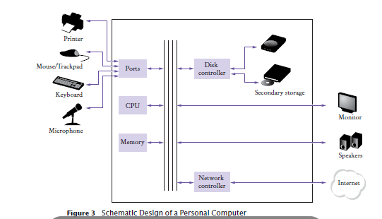

---
**PERIKSA DIRI**

4. Di mana program disimpan saat sedang tidak berjalan?
5. Bagian komputer mana yang melakukan operasi aritmatika, seperti penjumlahan?
dan perkalian?
6. Smartphone modern adalah komputer, sebanding dengan komputer desktop. Yang
komponen smartphone sesuai dengan yang ditunjukkan pada Gambar 3?

---

## *Komputasi & Masyarakat 1.1*   Komputer Ada Dimana-mana
---

Ketika komputer pertama kali ditemukan pada tahun 1940-an, sebuah komputer mengisi seluruh ruangan. Foto di bawah ini menunjukkan ENIAC (integrator numerik elektronik) dan komputer), selesai dalam 1946 di Universitas Pennsylvania.
ENIAC digunakan oleh militer untuk menghitung lintasan peluru.
Saat ini, fasilitas komputasi mesin pencari, toko internet, dan
jejaring sosial memenuhi gedung-gedung besar disebut pusat data. Di ujung lain spektrum, komputer ada di mana-mana
kita. Ponsel Anda memiliki komputer di dalam, seperti halnya banyak kartu kredit dan ongkos kartu untuk angkutan umum. Sebuah mobil modern memiliki beberapa komputer––untuk mengontrol mesin, rem, lampu, dan radio. 

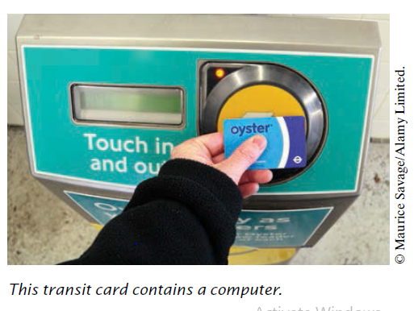

Munculnya di mana-mana komputasi berubah banyak aspek dari kami
hidup. Pabrik digunakan mempekerjakan orang untuk lakukan perakitan berulang tugas hari ini dilakukan oleh komputer yang dikendalikan robot, dioperasikan oleh beberapa orang yang tahu cara bekerja dengan komputer-komputer itu. Buku, musik, dan film saat ini sering dikonsumsi di komputer, dan komputer adalah hampir selalu terlibat dalam produksi mereka. Buku yang kamu sedang membaca sekarang tidak bisa telah ditulis tanpa komputer.

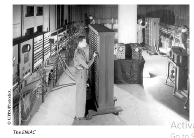

Mengetahui tentang komputer dan bagaimana memprogram mereka telah menjadi keterampilan penting dalam banyak karir. Insinyur merancang komputer yang dikendalikan mobil dan peralatan medis yang melestarikan kehidupan. Ilmuwan komputer mengembangkan program yang membantu orang berkumpul untuk mendukung sosial penyebab. Misalnya, aktivis menggunakan jejaring sosial untuk berbagi video menunjukkan penyalahgunaan oleh rezim represif, dan informasi ini sangat penting dalam mengubah opini publik.

Sebagai komputer, besar dan kecil, menjadi semakin tertanam dalam kami kehidupan sehari-hari, itu semakin penting agar semua orang mengerti caranya mereka bekerja, dan bagaimana bekerja dengan mereka. Saat Anda menggunakan buku ini untuk mempelajari caranya memprogram komputer, Anda akan mengembangkan pemahaman yang baik tentang komputasi
dasar yang akan membuat Anda warga negara yang lebih berpengetahuan dan, mungkin, seorang profesional komputasi.

## **1.3 Bahasa Pemrograman Java**

Untuk menulis program komputer, Anda perlu memberikan urutan instruksi yang dapat dijalankan oleh CPU. Sebuah program komputer terdiri dari sejumlah besar instruksi CPU, dan itu membosankan dan rawan kesalahan untuk menentukannya satu per satu. Oleh karena itu, <b>bahasa pemrograman tingkat tinggi</b> telah dibuat. Dalam tingkat tinggi bahasa, Anda menentukan tindakan yang harus dilakukan program Anda. <b>Kompilator</b>
menerjemahkan instruksi tingkat tinggi ke dalam instruksi yang lebih rinci (disebut kode mesin) yang dibutuhkan oleh CPU. Banyak bahasa pemrograman yang berbeda memiliki telah dirancang untuk tujuan yang berbeda.

Pada tahun 1991, sebuah grup yang dipimpin oleh James Gosling dan Patrick Naughton di Sun Microsystems merancang bahasa pemrograman, dengan nama kode "Hijau", untuk digunakan di konsumen perangkat, seperti kotak "set-top" televisi cerdas. Bahasa itu dirancang untuk sederhana, aman, dan dapat digunakan untuk berbagai jenis prosesor. Tidak ada pelanggan
pernah ditemukan untuk teknologi ini.

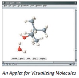

Gosling menceritakan bahwa pada tahun 1994 tim menyadari,
“Kita bisa menulis browser yang sangat keren. Itu satu
dari beberapa hal di aliran utama klien/server yang membutuhkan beberapa hal aneh yang telah kami lakukan:
arsitektur netral, real-time, andal, aman.” Java diperkenalkan kepada orang banyak yang antusias di pameran SunWorld pada tahun 1995, bersama dengan browser yang menjalankan <b>applet</b>—kode Java yang dapat terletak di mana saja di Internet. Sosok di kanan menunjukkan contoh khas applet.

Sejak saat itu, Java tumbuh dengan kecepatan yang fenomenal.
Pemrogram telah memeluk bahasa ini karena lebih mudah digunakan daripada saingan terdekatnya, C++. Selain itu, Java memiliki <b>perpustakaan</b> yang kaya yang memungkinkan untuk menulis program portabel yang dapat melewati operasi berpemilik
sistem—fitur yang sangat dicari oleh mereka yang ingin mandiri
dari sistem berpemilik itu dan diperjuangkan dengan sengit oleh vendor mereka. Sebuah "edisi mikro" dan "edisi perusahaan" dari perpustakaan Java memungkinkan pemrogram Java untuk menargetkan perangkat keras mulai dari kartu pintar hingga server Internet terbesar.

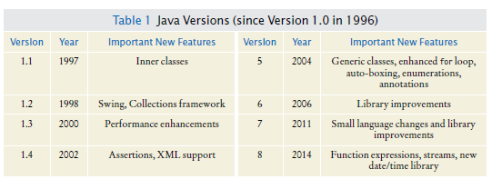

Karena Java dirancang untuk Internet, ia memiliki dua atribut yang membuatnya sangat cocok untuk pemula: keamanan dan portabilitas.

Java dirancang agar siapa pun dapat menjalankan program di browser mereka tanpa takut. Fitur keamanan bahasa Java memastikan bahwa suatu program dihentikan jika: mencoba melakukan sesuatu yang tidak aman. Memiliki lingkungan yang aman juga bermanfaat bagi siapa saja belajar bahasa jawa. Saat Anda membuat kesalahan yang mengakibatkan perilaku tidak aman, program Anda dihentikan dan Anda menerima laporan kesalahan yang akurat.

Manfaat lain dari Java adalah portabilitas. Program Java yang sama akan berjalan, tanpa ubah, di Windows, UNIX, Linux, atau Macintosh. Untuk mencapai portabilitas, compiler Java tidak menerjemahkan program Java secara langsung ke dalam instruksi CPU. Sebaliknya, program Java yang dikompilasi berisi instruksi untuk <b>mesin virtual</b> Java, sebuah program yang mensimulasikan CPU nyata. Portabilitas adalah manfaat lain untuk awal murid. Anda tidak perlu belajar bagaimana menulis program untuk platform yang berbeda.

Saat ini, Java telah ditetapkan sebagai salah satu bahasa yang paling penting untuk pemrograman tujuan umum serta untuk instruksi ilmu komputer. Namun, meskipun Java adalah bahasa yang baik untuk pemula, itu tidak sempurna, karena tiga alasan.

Karena Java tidak dirancang khusus untuk siswa, tidak ada pemikiran yang diberikan untuk membuatnya sangat sederhana untuk menulis program dasar. Sejumlah tertentu mesin teknis
diperlukan untuk menulis bahkan program yang paling sederhana. Ini bukan masalah untuk profesional programmer, tetapi bisa menjadi gangguan bagi siswa pemula. Saat Anda belajar
cara memprogram di java, akan ada saatnya anda akan diminta untuk puas penjelasan awal dan tunggu detail lebih lengkapnya di bab selanjutnya.

Java telah diperpanjang berkali-kali selama hidupnya—lihat Tabel 1. Dalam buku ini, kami asumsikan Anda memiliki Java versi 7 atau yang lebih baru.

Akhirnya, Anda tidak dapat berharap untuk mempelajari semua bahasa Jawa dalam satu kursus. Bahasa Jawa itu sendiri relatif sederhana, tetapi Java berisi sekumpulan besar <i>paket perpustakaan</i> yang diperlukan untuk menulis program yang bermanfaat. Ada paket usia untuk grafis, desain antarmuka pengguna, kriptografi, jaringan, suara, penyimpanan database, dan banyak tujuan lainnya. Bahkan programmer Java ahli tidak dapat berharap untuk mengetahui isi dari semua paket—
mereka hanya menggunakan yang mereka butuhkan untuk proyek tertentu.

Dengan menggunakan buku ini, Anda diharapkan dapat belajar banyak tentang bahasa Jawa dan tentang paket yang paling penting. Ingatlah bahwa tujuan utama dari ini Buku itu bukan untuk membuatmu menghafalkan hal-hal kecil Java, tapi untuk mengajarimu cara berpikir tentang pemrograman.

---
**PERIKSA DIRI**

7. Apa dua manfaat terpenting dari bahasa Java?
8. Berapa lama waktu yang dibutuhkan untuk mempelajari seluruh perpustakaan Java?

---

## **1.4 Menjadi Familiar dengan Anda Lingkungan Pemrograman**

Banyak siswa menemukan bahwa alat yang mereka butuhkan sebagai programmer sangat berbeda dari perangkat lunak yang mereka kenal. Anda harus meluangkan waktu untuk membuat diri Anda sendiri akrab dengan lingkungan pemrograman Anda. Karena sistem komputer bervariasi secara luas, buku ini hanya dapat memberikan garis besar langkah-langkah yang perlu Anda ikuti. Ini bagus ide untuk berpartisipasi dalam lab langsung, atau meminta teman yang berpengetahuan luas untuk memberi Anda tur.

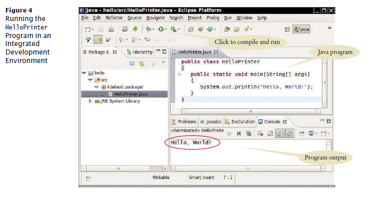

<b>Step 1</b>  Mulai lingkungan pengembangan Java.
 
Sistem komputer sangat berbeda dalam hal ini. Pada banyak komputer ada yang <b>terintegrasi lingkungan pengembangan</b> di mana Anda dapat menulis dan menguji program Anda. Di komputer lain Anda pertama kali meluncurkan editor, program yang berfungsi seperti kata prosesor, di mana Anda dapat memasukkan instruksi Java Anda; Anda kemudian membuka konsol
jendela dan ketik perintah untuk menjalankan program Anda. Anda perlu mencari tahu caranya memulai dengan lingkungan Anda. 

<b>Step 2</b> Menulis program sederhana.
 Pilihan tradisional untuk program pertama dalam bahasa pemrograman baru adalah sebuah program yang menampilkan salam sederhana: "Halo, Dunia!". Mari kita ikuti tradisi itu.
Inilah "Halo, Dunia!" program di Jawa:

    public class HelloPrinter
    {
        public static void main(String[] args)
        {
            System.out.println("Hello, World!");
        }
    }

Kami akan memeriksa program ini di bagian selanjutnya.

Apa pun lingkungan pemrograman yang Anda gunakan, Anda memulai aktivitas dengan mengetik pernyataan program ke dalam jendela editor.

Buat file baru dan beri nama HelloPrinter.java, menggunakan langkah-langkah yang sesuai untuk lingkungan Anda. (Jika lingkungan Anda mengharuskan Anda memberikan nama proyek
selain nama file, gunakan nama hello untuk proyek tersebut.) Masuk ke program instruksi <i>persis</i> seperti yang diberikan di atas. Atau, cari salinan elektroniknya dalam kode pendamping buku ini dan tempelkan ke editor Anda.

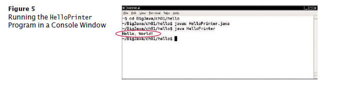

Saat Anda menulis program ini, perhatikan baik-baik berbagai simbol, dan simpan mengingat bahwa Java <b>peka huruf besar-kecil</b>. Anda harus memasukkan huruf besar dan kecil dengan tepat seperti yang muncul dalam daftar program. Anda tidak dapat mengetik MAIN atau PrintLn. Jika Anda tidak
hati-hati, Anda akan mengalami masalah—lihat Kesalahan Umum 1.2 di halaman 15.

<b>Step 3</b> Jalankan programnya.
 Proses untuk menjalankan program sangat bergantung pada lingkungan pemrograman Anda. Anda mungkin harus mengklik tombol atau memasukkan beberapa perintah. Saat Anda menjalankan
program uji, pesannya

    Hello, World!

akan muncul di suatu tempat di layar (lihat Gambar 4 dan 5).

Untuk menjalankan program Anda, kompiler Java menerjemahkan <b>file sumber</b> Anda (yang adalah, pernyataan yang Anda tulis) ke dalam file kelas. (File kelas berisi instruksi untuk
mesin virtual Java.) Setelah kompiler menerjemahkan <b>kode sumber</b> Anda ke dalam instruksi mesin virtual, mesin virtual mengeksekusinya. Selama eksekusi, mesin virtual mengakses perpustakaan kode yang telah ditulis sebelumnya, termasuk implementasinya kelas System dan PrintStream yang diperlukan untuk menampilkan program keluaran. Gambar 6 merangkum proses membuat dan menjalankan program Java. Di beberapa lingkungan pemrograman, kompiler dan mesin virtual adalah pada dasarnya tidak terlihat oleh programmer — mereka secara otomatis dieksekusi kapan saja Anda meminta untuk menjalankan program Java. Di lingkungan lain, Anda perlu meluncurkan kompiler dan mesin virtual secara eksplisit.

<b>Step 4</b> Atur pekerjaan Anda.
 
Sebagai seorang programmer, Anda menulis program, mencobanya, dan memperbaikinya. Anda menyimpan program Anda dalam <b>file</b>. File disimpan dalam <b>folder</b> atau <b>direktori</b>. Sebuah folder dapat berisi

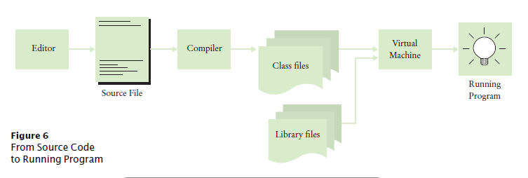

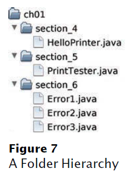

file serta folder lain, yang dengan sendirinya dapat berisi lebih banyak file dan folder (lihat Gambar 7). Hirarki ini bisa sangat besar, dan Anda tidak perlu khawatir dengan semuanya
cabang-cabangnya. Namun, Anda harus membuat folder untuk mengatur pekerjaan Anda. Ini adalah sebuah ide bagus untuk membuat folder terpisah untuk kursus pemrograman Anda. Di dalam itu folder, buat folder tersendiri untuk setiap program.

Beberapa lingkungan pemrograman menempatkan program Anda ke lokasi default jika Anda tidak menentukan folder sendiri. Dalam hal ini, Anda perlu mencari tahu di mana file-file itu berada.

Pastikan Anda memahami di mana file Anda berada dalam hierarki folder. Informasi ini penting saat Anda mengirimkan file untuk penilaian, dan untuk pembuatan salinan cadangan (lihat Tip Pemrograman 1.1).

---
**PERIKSA DIRI**

9. Di mana file HelloPrinter.java disimpan di komputer Anda?
10. Apa yang Anda lakukan untuk melindungi diri dari kehilangan data saat Anda mengerjakan pemrograman?
proyek?

---

## Tip Pemrograman 1.1

Salinan cadangan
---

Anda akan menghabiskan banyak waktu untuk membuat dan meningkatkan program Java. Dia mudah menghapus file secara tidak sengaja, dan terkadang file hilang karena dari kerusakan komputer. Mengetik ulang konten file yang hilang membuat frustrasi dan memakan waktu. Oleh karena itu sangat penting bahwa Anda belajar cara mengamankan file dan membiasakan diri melakukannya sebelumnya bencana melanda. Mencadangkan file pada stik memori adalah metode penyimpanan yang mudah dan nyaman
untuk banyak orang. Bentuk cadangan lain yang semakin populer adalah penyimpanan file Internet. Di Sini adalah beberapa petunjuk yang perlu diingat:

* *Sering-seringlah membuat cadangan*. Mencadangkan file hanya membutuhkan beberapa detik, dan kamu akan membenci dirimu sendiri jika harus menghabiskan waktu berjam-jam
menciptakan kembali pekerjaan yang bisa Anda simpan dengan mudah. Saya merekomendasi bahwa Anda membuat cadangan pekerjaan Anda setiap tiga puluh menit sekali.
* *Putar cadangan*. Gunakan lebih dari satu direktori untuk cadangan, dan putar mereka. Yaitu, pertama kembali ke direktori pertama. Kemudian kembali ke direktori kedua. Kemudian gunakan ketiga, dan kemudian kembali ke yang pertama. Dengan begitu Anda selalu memiliki tiga cadangan terbaru. Jika
perubahan terbaru Anda memperburuk keadaan, Anda kemudian dapat kembali ke versi yang lebih lama.
* *Perhatikan arah pencadangan*. Pencadangan melibatkan penyalinan file dari satu tempat ke lain. Anda harus melakukannya dengan benar—yaitu, menyalin dari lokasi kerja Anda ke lokasi cadangan. Jika Anda melakukannya dengan cara yang salah, Anda akan menimpa file yang lebih baru dengan
versi yang lebih lama.
* *Periksa cadangan Anda sesekali*. Periksa kembali apakah cadangan Anda berada di tempat yang Anda pikirkan
mereka. Tidak ada yang lebih membuat frustrasi daripada mengetahui bahwa cadangan tidak ada ketika Anda membutuhkan mereka.
* *Periksa cadangan Anda sesekali*. Periksa kembali apakah cadangan Anda berada di tempat yang Anda pikirkan mereka. Tidak ada yang lebih membuat frustrasi daripada mengetahui bahwa cadangan tidak ada ketika Anda membutuhkan mereka.
* *Santai, lalu pulihkan*. Saat Anda kehilangan file dan perlu memulihkannya dari cadangan, Anda mungkin dalam keadaan tidak bahagia dan gugup. Ambil napas dalam-dalam dan pikirkan baik-baik proses pemulihan sebelum Anda mulai. Bukan hal yang aneh bagi pengguna komputer yang gelisah untuk hapus cadangan terakhir saat mencoba memulihkan file yang rusak.

---

## **1.5 Menganalisis Program Pertama Anda**

Pada bagian ini, kita akan menganalisis program Java pertama secara rinci. Di sini lagi adalah Kode sumber:

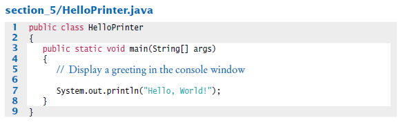

Garis

    public class HelloPrinter

menunjukkan deklarasi **kelas** yang disebut HelloPrinter.

Setiap program Java terdiri dari satu atau lebih kelas. Kami akan membahas kelas lebih lanjut rinci dalam Bab 2 dan 3.

Kata publik menunjukkan bahwa kelas dapat digunakan oleh "publik". Anda akan nanti menemukan fitur pribadi.

Di Java, setiap file sumber dapat berisi paling banyak satu kelas publik, dan nama dari kelas publik harus cocok dengan nama file yang berisi kelas tersebut. Misalnya, kelas HelloPrinter harus terdapat dalam sebuah file bernama HelloPrinter.java.

Konstruksi

    public static void main(String[] args)
    {
    . . .
    }

mendeklarasikan <b>metode</b> yang disebut main. Sebuah metode berisi kumpulan pemrograman instruksi yang menjelaskan bagaimana melaksanakan tugas tertentu. Setiap aplikasi Java
harus memiliki <b>metode utama</b>. Sebagian besar program Java berisi metode lain selain utama, dan Anda akan melihat di Bab 3 cara menulis metode lain.

Istilah statis dijelaskan secara lebih rinci dalam Bab 8, dan arti dari String[] args dibahas dalam Bab 11. Saat ini, cukup pertimbangkan 

    public class ClassName
    {
    public static void main(String[] args)
    {
    . . .
    }
    }

sebagai bagian dari "pipa" yang diperlukan untuk membuat program Java. Program pertama kami memiliki semua instruksi di dalam metode utama kelas.

Metode utama berisi satu atau lebih instruksi yang disebut <b>pernyataan</b>. Setiap pernyataan diakhiri dengan tanda titik koma (;). Ketika sebuah program berjalan, pernyataan dalam metode utama dijalankan satu per satu. 

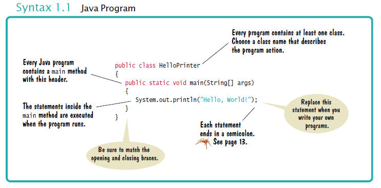

Dalam program contoh kami, metode utama memiliki satu pernyataan:
    
    System.out.println("Hello, World!");    

Pernyataan ini mencetak sebaris teks, yaitu “Halo, Dunia!”. Dalam pernyataan ini, kami menyebut metode yang, untuk alasan yang tidak akan kami jelaskan di sini, ditentukan oleh nama panjang System.out.println.

Kita tidak harus mengimplementasikan metode ini—programmer yang menulis Java perpustakaan sudah melakukannya untuk kita. Kami hanya ingin metode untuk melakukan yang dimaksudkan tugas, yaitu mencetak nilai.

Setiap kali Anda memanggil metode di Java, Anda perlu menentukan
1. Metode yang ingin Anda gunakan (dalam hal ini, System.out.println).
2. Nilai apa pun yang dibutuhkan metode untuk menjalankan tugasnya (dalam hal ini, "Halo, Dunia!").
Istilah teknis untuk nilai seperti itu adalah **argumen**. Argumen terlampir dalam
tanda kurung. Beberapa argumen dipisahkan dengan koma.

Urutan karakter yang diapit tanda kutip

    "Hello, World!"

disebut <b>string</b>. Anda harus menyertakan isi string di dalam tanda kutip sehingga kompiler mengetahui maksud Anda secara harfiah "Halo, Dunia!". Ada alasan untuk persyaratan ini. Misalkan Anda perlu mencetak kata main. Dengan melampirkannya dalam kutipan tanda, "utama", kompiler tahu maksud Anda urutan karakter m a i n, bukan metode bernama main. Aturannya sederhana, Anda harus menyertakan semua string teks
dalam tanda kutip, sehingga kompiler menganggapnya sebagai teks biasa dan tidak mencoba menafsirkannya sebagai instruksi program.

Anda juga dapat mencetak nilai numerik. Misalnya, pernyataan

    System.out.println(3 + 4);

mengevaluasi ekspresi 3 + 4 dan menampilkan angka 7.

Metode System.out.println mencetak string atau angka dan kemudian memulai yang baru garis. Misalnya, urutan pernyataan

    System.out.println("Hello");
    System.out.println("World!");

mencetak dua baris teks:

    Hello
    World!

Ada metode kedua, System.out.print, yang dapat Anda gunakan untuk mencetak item tanpa memulai baris baru. Misalnya, output dari dua pernyataan

    System.out.print("00");
    System.out.println(3 + 4);

adalah garis tunggal

    007

---
**PERIKSA DIRI**

11. Bagaimana Anda memodifikasi program HelloPrinter untuk menyambut Anda?
12. Bagaimana Anda memodifikasi program HelloPrinter untuk mencetak kata “Halo” Tegak lurus?
13. Apakah program akan terus bekerja jika Anda mengganti baris 7 dengan pernyataan ini?
System.out.println(Halo);
14. Apa yang dicetak oleh kumpulan pernyataan berikut?
System.out.print("Angka keberuntungan saya adalah");
System.out.println(3 + 4 + 5);
15. Apa yang dicetak oleh pernyataan berikut?
System.out.println("Halo");
System.out.println("");
System.out.println("Dunia");

---

## Kesalahan Umum 1.1 **Menghilangkan Titik Koma**

Di Java setiap pernyataan harus diakhiri dengan titik koma. Lupa mengetik titik koma adalah hal biasa kesalahan. Ini membingungkan kompiler, karena kompiler menggunakan titik koma untuk menemukan di mana satu pernyataan berakhir dan pernyataan berikutnya dimulai. Kompiler tidak menggunakan jeda baris atau kurung kurawal untuk mengenali akhir pernyataan. Misalnya, kompiler menganggap

    System.out.println("Hello")
    System.out.println("World!");

satu pernyataan, seolah-olah Anda telah menulis

    System.out.println("Hello") System.out.println("World!");

Kemudian tidak mengerti pernyataan itu, karena tidak mengharapkan kata Sistem mengikuti
kurung penutup setelah "Halo".

Obatnya sederhana. Pindai setiap pernyataan untuk tanda titik koma, seperti yang Anda lakukan periksa apakah setiap kalimat bahasa Inggris diakhiri dengan tanda titik. Namun, jangan tambahkan titik koma di akhir kelas publik Halo atau public static void main. Garis-garis ini bukan pernyataan.

## **1.6 Kesalahan**

Bereksperimenlah sedikit dengan program HelloPrinter. Apa yang terjadi jika Anda membuat kesalahan pengetikan seperti

    System.ou.println("Hello, World!");
    System.out.println("Hello, Word!");

Dalam kasus pertama, kompiler akan mengeluh. Itu akan
mengatakan bahwa itu tidak tahu apa yang Anda maksud dengan ou. Itu kata-kata yang tepat dari pesan kesalahan tergantung
di lingkungan pengembangan Anda, tetapi mungkin saja sesuatu seperti "Tidak dapat menemukan simbol ou". Ini adalah sebuah
<b>kesalahan waktu kompilasi</b>. Ada yang salah menurut dengan aturan bahasa dan kompiler menemukannya. Untuk alasan ini, kesalahan waktu kompilasi adalah sering disebut <b>kesalahan sintaks</b>. Ketika kompilator menemukan satu atau lebih kesalahan, ia menolak untuk menerjemahkan program ke mesin virtual Java instruksi, dan sebagai akibatnya Anda tidak memiliki program yang dapat dijalankan. Kamu harus perbaiki kesalahan dan kompilasi lagi. Faktanya, kompilernya cukup pilih-pilih, dan itu umum untuk melewati beberapa putaran memperbaiki kesalahan waktu kompilasi sebelum kompilasi berhasil
untuk pertama kalinya.

Jika kompiler menemukan kesalahan, itu tidak akan berhenti dan menyerah begitu saja. Ini akan mencoba untuk laporkan kesalahan sebanyak mungkin, sehingga Anda dapat memperbaiki semuanya sekaligus.

Terkadang, kesalahan membuat kompiler keluar jalur. Misalkan, misalnya, Anda lupakan tanda kutip di sekitar string: System.out.println(Halo, Dunia!). Itu compiler tidak akan mengeluh tentang tanda kutip yang hilang. Sebaliknya, itu akan melaporkan
"Tidak dapat menemukan simbol Halo". Sayangnya, kompilernya tidak terlalu pintar dan itu tidak menyadari bahwa Anda bermaksud menggunakan string. Terserah Anda untuk menyadari bahwa Anda membutuhkan untuk melampirkan string dalam tanda kutip.

Kesalahan pada baris kedua di atas adalah jenis yang berbeda. Program akan dikompilasi dan jalankan, tetapi outputnya akan salah. Ini akan mencetak

    Hello, Word!

Ini adalah <b>kesalahan run-time</b>. Program ini secara sintaksis benar dan melakukan sesuatu, tetapi tidak melakukan apa yang seharusnya dilakukan. Karena kesalahan run-time disebabkan oleh kelemahan logis dalam program, mereka sering disebut <b>kesalahan logika</b>.

Kesalahan run-time khusus ini tidak menyertakan pesan kesalahan. Itu hanya menghasilkan keluaran yang salah. Beberapa jenis kesalahan run-time sangat parah sehingga menghasilkan
<b>pengecualian</b>: pesan kesalahan dari mesin virtual Java. Misalnya, jika program Anda menyertakan pernyataan

    System.out.println(1 / 0);

Anda akan mendapatkan pesan kesalahan run-time "Pembagian dengan nol".

Selama pengembangan program, kesalahan tidak dapat dihindari. Setelah program lebih lama dari beberapa baris, itu akan membutuhkan konsentrasi manusia super untuk memasukkannya dengan benar tanpa tergelincir sekali. Anda akan menemukan diri Anda menghilangkan titik koma atau kutipan menandai lebih sering daripada yang Anda inginkan, tetapi kompiler akan melacak masalah ini untukmu.

Kesalahan run-time lebih merepotkan. Kompiler tidak akan menemukannya—bahkan, kompiler akan dengan senang hati menerjemahkan program apa pun selama sintaksnya benar tetapi program yang dihasilkan akan melakukan sesuatu yang salah. Ini adalah tanggung jawab pembuat program untuk menguji program dan menemukan kesalahan run-time.

---
**PERIKSA DIRI**

16. Misalkan Anda menghilangkan karakter "" di sekitar Hello, World! dari HelloPrinter. program jawa. Apakah ini kesalahan waktu kompilasi atau kesalahan waktu proses?
17. Misalkan Anda mengubah println menjadi printline pada program HelloPrinter.java. Apakah ini kesalahan waktu kompilasi atau kesalahan waktu proses?
18. Misalkan Anda mengubah main menjadi hello pada program HelloPrinter.java. Apakah ini kesalahan waktu kompilasi atau kesalahan waktu proses?
19. Saat Anda menggunakan komputer, Anda mungkin pernah mengalami program yang “crash” (berhenti spontan) atau “hung” (gagal menanggapi masukan Anda). Adalah perilaku itu kesalahan waktu kompilasi atau kesalahan waktu proses?
20. Mengapa Anda tidak dapat menguji program untuk kesalahan run-time?
---

## Kesalahan Umum 1.2 **Kata-kata yang salah eja**

Jika Anda secara tidak sengaja salah mengeja kata, maka hal-hal aneh mungkin terjadi, dan itu mungkin tidak selalu benar-benar jelas dari pesan kesalahan apa yang salah. Berikut adalah contoh yang bagus tentang caranya kesalahan ejaan sederhana dapat menyebabkan masalah:

    public class HelloPrinter
    {
    public static void Main(String[] args)
    {
    System.out.println("Hello, World!");
    }
    }

Kelas ini mendeklarasikan sebuah metode yang disebut Main. Kompiler tidak akan menganggap ini sama dengan metode utama, karena Utama dimulai dengan huruf besar dan bahasa Java peka huruf besar-kecil. Huruf besar dan huruf kecil dianggap benar-benar berbeda satu sama lain, dan untuk kompiler Main tidak lebih cocok untuk main daripada rain. Kompiler akan dengan senang hati kompilasi metode Utama Anda, tetapi ketika mesin virtual Java membaca file yang dikompilasi, itu akan
mengeluh tentang metode utama yang hilang dan menolak untuk menjalankan program. Tentu saja, pesannya "metode utama yang hilang" akan memberi Anda petunjuk di mana mencari kesalahan.

Jika Anda mendapatkan pesan kesalahan yang tampaknya menunjukkan bahwa kompiler atau mesin virtual aktif trek yang salah, periksa ejaan dan kapitalisasi. Jika Anda salah mengeja nama simbol (misalnya, ou alih-alih keluar), kompiler akan menghasilkan pesan seperti "tidak dapat menemukan simbol"
kamu”. Pesan kesalahan itu biasanya merupakan petunjuk bagus bahwa Anda membuat kesalahan ejaan.

## **1.7 Pemecahan Masalah: Desain Algoritma**

Anda akan segera belajar bagaimana memprogram perhitungan dan pengambilan keputusan di Java. Tetapi sebelum kita melihat mekanisme penerapan perhitungan di bab berikutnya, mari kita pertimbangkan bagaimana Anda dapat menjelaskan langkah-langkah yang diperlukan untuk menemukan solusinya untuk sebuah masalah.

### **1.7.1 Konsep Algoritma**

Anda mungkin pernah melihat iklan yang mendorong Anda untuk membayar layanan komputerisasi yang cocok Anda up dengan pasangan cinta. Memikirkan bagaimana ini bisa berhasil. Anda mengisi formulir dan mengirim itu masuk. Orang lain melakukan hal yang sama. Data diproses oleh sebuah program komputer. Apakah masuk akal untuk berasumsi? bahwa komputer dapat melakukan tugas menemukan pasangan terbaik untukmu? Misalkan Anda lebih muda saudara, bukan komputer, memiliki semua formulir di nya meja. Instruksi apa yang bisa Anda berikan padanya? Anda tidak bisa mengatakan, “Temukan orang yang paling tampan yang suka inline skating dan browsing internet”. Di sana
bukan standar objektif untuk ketampanan, dan Anda pendapat saudara (atau program komputer menganalisis foto calon mitra) kemungkinan akan berbeda dengan milik Anda. Jika Anda tidak dapat memberikan instruksi tertulis kepada seseorang untuk memecahkan masalah, tidak mungkin komputer secara ajaib dapat menemukan solusi yang tepat. Komputer hanya dapat melakukan apa
Anda menyuruhnya melakukan. Itu hanya melakukannya lebih cepat, tanpa bosan atau lelah.

Oleh karena itu, layanan pembuatan jodoh yang terkomputerisasi tidak dapat menjamin untuk menemukan pasangan yang optimal untuk Anda. Sebagai gantinya, Anda mungkin disajikan dengan satu set mitra potensial yang berbagi minat yang sama dengan Anda. Itu adalah tugas yang program komputer bisa memecahkan. 

Agar program komputer memberikan jawaban atas masalah yang menghitung jawaban, itu harus mengikuti urutan langkah-langkah yang

* Jelas
* Dapat dijalankan
* Mengakhiri

Urutan langkah tidak ambigu ketika ada instruksi yang tepat untuk apa yang harus dilakukan pada setiap langkah dan ke mana harus pergi selanjutnya. Tidak ada ruang untuk menebak atau pendapat pribadi. Suatu langkah dapat dieksekusi ketika dapat dilakukan dalam praktik. Misalnya, komputer dapat membuat daftar semua orang yang berbagi hobi Anda, tetapi tidak dapat memprediksi siapa yang akan menjadi Anda pasangan seumur hidup. Akhirnya, urutan langkah berakhir jika akhirnya akan datang
berakhir. Sebuah program yang terus bekerja tanpa memberikan jawaban jelas tidak berguna.

Urutan langkah yang tidak ambigu, dieksekusi, dan penghentian disebut <b>algoritma</b>. Meskipun tidak ada algoritma untuk menemukan pasangan, banyak masalah memang memiliki algoritma untuk dipecahkan mereka. Bagian berikutnya memberikan contoh.

## **1.7.2 Algoritma untuk Memecahkan Masalah Investasi**

Pertimbangkan masalah investasi berikut:

    Anda memasukkan $10.000 ke dalam rekening bank yang menghasilkan bunga 5 persen per tahun. Berapa banyak
    tahun yang diperlukan agar saldo akun menjadi dua kali lipat dari aslinya?

Bisakah Anda memecahkan masalah ini dengan tangan? Tentu, Anda bisa. Anda mengetahui keseimbangannya
sebagai berikut:

| tahun | minat | seimbang |
| --- | --- | --- |
| 0 | |10000|
|1 | 10000.00 x 0.05 | 10000.00 + 500.00 = 10500.00|
| 2 | 10500.00 x 0.05 = 525.00 | 10500.00 + 525.00 = 11025.00 |
 3 | 11025.00 x 0.05 = 551.25 | 11025.00 + 551.25 = 11576.25 |
 | 4 | 11576.25 x 0.05 = 578.81 | 11576.25 + 578.81 = 12155.06 |

 

 Anda terus berjalan sampai saldo setidaknya $20.000. Kemudian angka terakhir di tahun ini kolom adalah jawabannya.

Tentu saja, melakukan perhitungan ini sangat membosankan bagi Anda atau Anda adik laki-laki. Tetapi komputer sangat pandai melakukan perhitungan berulang dengan cepat dan tanpa cacat. Yang penting bagi komputer adalah deskripsi dari langkah mencari solusi. Setiap langkah harus jelas dan tidak berbelit-belit, tidak memerlukan tebak-tebakan. Berikut adalah deskripsi seperti itu:

**Mulailah dengan nilai tahun 0, kolom untuk bunga, dan saldo $10.000.**

| tahun | minat | seimbang |
| --- | --- | --- |
| 0 |  | 100000 |
| | |

**Ulangi langkah berikut saat saldo kurang dari $20,000**

    Tambahkan 1 ke nilai tahun.
    Hitung bunga sebagai saldo x 0,05 (yaitu, bunga 5 persen).
    Tambahkan bunga ke saldo.

| tahun | minat | seimbang |
| --- | --- | --- |
| 0 | | 10000|
| 1 | 500.00 | 10500.00 |
| 14 | 942.82 | 19799.32 |
| 15 | 989.96 | 20789.28 | 

**Laporkan nilai tahun terakhir sebagai jawabannya.**

Langkah-langkah ini belum dalam bahasa yang dapat dipahami oleh komputer, tetapi Anda akan segera pelajari cara merumuskannya di Jawa. Deskripsi informal ini disebut pseudocode. Kami memeriksa aturan untuk menulis pseudocode di bagian selanjutnya.

### **1.7.3 Pseudocode**

Tidak ada persyaratan ketat untuk pseudocode karena dibaca oleh pembaca manusia, bukan program komputer. Berikut adalah jenis-jenis pernyataan pseudocode dan bagaimana kita:
akan menggunakannya dalam buku ini:

* Gunakan pernyataan seperti berikut ini untuk menjelaskan bagaimana suatu nilai ditetapkan atau diubah:

**biaya total = harga beli + biaya operasi Kalikan nilai saldo dengan 1,05.**

**Hapus karakter pertama dan terakhir dari kata.**

* Jelaskan keputusan dan pengulangan sebagai berikut:

    **Jika total biaya 1 < total biaya 2**

    **Sementara saldo kurang dari $20,000**

    **Untuk setiap gambar dalam urutan**

    Gunakan lekukan untuk menunjukkan pernyataan mana yang harus dipilih atau diulang:

    **Untuk setiap mobil**

    **biaya operasi = 10 x biaya bahan bakar tahunan**

    **biaya total = harga beli + biaya operasi**

    Di sini, lekukan menunjukkan bahwa kedua pernyataan harus dieksekusi untuk setiap mobil.

* Tunjukkan hasil dengan pernyataan seperti:

    **Pilih mobil1.**

    **Laporkan nilai tahun terakhir sebagai jawabannya.**

## **1.7.4 Dari Algoritma ke Program**

Di Bagian 1.7.2, kami mengembangkan kodesemu untuk menemukan berapa lama waktu yang dibutuhkan untuk menggandakan
investasi. Mari kita periksa kembali bahwa pseudocode mewakili suatu algoritma; itu adalah, bahwa itu tidak ambigu, dapat dieksekusi, dan diakhiri.

Pseudocode kami tidak ambigu. Ini hanya memberi tahu cara memperbarui nilai di setiap langkah. Pseudocode dapat dieksekusi karena kami menggunakan tingkat bunga tetap. Apakah kami mengatakan untuk menggunakan tingkat bunga aktual yang akan dibebankan di tahun-tahun mendatang, dan bukan tingkat bunga tetap 5 persen per tahun, instruksi tidak akan dapat dieksekusi. Tidak ada jalan bagi siapa pun untuk mengetahui berapa tingkat bunga di masa depan. Ini membutuhkan sedikit
berpikir untuk melihat bahwa langkah-langkahnya berakhir: Dengan setiap langkah, keseimbangan naik setidaknya $ 500, jadi akhirnya harus mencapai $ 20.000.

Oleh karena itu, kami telah menemukan algoritme untuk menyelesaikan masalah investasi kami, dan
kami tahu kami dapat menemukan solusinya dengan memprogram komputer. keberadaan algoritma adalah prasyarat penting untuk memprogram tugas. Anda harus terlebih dahulu temukan dan jelaskan algoritma untuk tugas sebelum Anda memulai pemrograman (lihat Angka 8). Dalam bab-bab berikutnya, Anda akan mempelajari cara mengekspresikan algoritme dalam
bahasa Java.

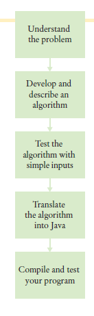

**PERIKSA DIRI**

21. Misalkan tingkat bunga adalah 20 persen. Berapa lama waktu yang dibutuhkan untuk investasi?
untuk menggandakan?
22. Misalkan operator ponsel Anda menagih Anda $29,95 hingga 300 menit
panggilan, dan $0,45 untuk setiap menit tambahan, ditambah pajak dan biaya 12,5 persen. Memberi
algoritma untuk menghitung biaya bulanan dari sejumlah menit tertentu.
23. Perhatikan pseudocode berikut untuk menemukan foto paling menarik dari urutan foto:

    **Pilih foto pertama dan beri nama "yang terbaik sejauh ini".**

    **Untuk setiap foto dalam urutan**

    **Jika itu lebih menarik daripada "terbaik sejauh ini"**

    **Buang "yang terbaik sejauh ini".**

    **Sebut foto ini "yang terbaik sejauh ini".**

    **Foto yang disebut "yang terbaik sejauh ini" adalah foto paling menarik dalam urutan itu.**

Apakah ini algoritma yang akan menemukan foto paling menarik?

24. Misalkan setiap foto di Self Check 23 memiliki label harga. Berikan algoritma untuk menemukan foto paling mahal.
25. Misalkan Anda memiliki urutan acak kelereng hitam dan putih dan ingin atur ulang sehingga kelereng hitam dan putih dikelompokkan bersama. Mempertimbangkan
algoritma ini:
    **Ulangi sampai terurut**
    **Temukan kelereng hitam pertama yang didahului oleh kelereng putih, dan alihkan.**

Apa yang dilakukan algoritme dengan urutan ●❍●●? Sebutkan langkah-langkahnya
sampai algoritma berhenti.
26. Misalkan Anda memiliki urutan acak kelereng berwarna. Pertimbangkan kode semu ini:
    **Ulangi sampai terurut**
    **Temukan kelereng pertama yang didahului oleh kelereng dengan warna berbeda, dan ganti.**

Mengapa ini bukan algoritma?

### **BAGAIMANA 1.1**
**Menjelaskan Algoritma dengan Pseudocode**

Ini adalah yang pertama dari banyak bagian "Cara" dalam buku ini yang memberi Anda langkah-demi-langkah Prosedur untuk melaksanakan tugas-tugas penting dalam mengembangkan program komputer.

Sebelum Anda siap untuk menulis program di Java, Anda perlu mengembangkan algoritma metode untuk sampai pada solusi untuk masalah tertentu. Jelaskan algoritma dalam pseudocode––
urutan langkah-langkah yang tepat dirumuskan dalam bahasa Inggris. Untuk mengilustrasikannya, kami akan merancang sebuah algoritme untuk masalah ini:

<b>Pernyataan Masalah</b> Anda memiliki pilihan untuk membelinya
dari dua mobil. Yang satu lebih hemat bahan bakar dari yang lain, tapi juga lebih mahal. Anda tahu harga dan efisiensi bahan bakar (dalam mil per galon, mpg) dari kedua mobil. Anda berencana untuk menyimpan mobil selama sepuluh bertahun-tahun. Asumsikan harga $4 per galon gas dan penggunaan 15.000
mil per tahun. Anda akan membayar tunai untuk mobil dan tidak khawatir tentang biaya pembiayaan. Mobil mana yang lebih baik?

**Langkah 1** Tentukan input dan output.

Dalam contoh masalah kami, kami memiliki input ini:
* harga beli1 dan efisiensi bahan bakar1, harga dan efisiensi bahan bakar (dalam mpg) mobil pertama
* harga beli2 dan efisiensi bahan bakar2, harga dan efisiensi bahan bakar mobil kedua

Kami hanya ingin tahu mobil mana yang lebih baik dibeli. Itu adalah keluaran yang diinginkan.

**Langkah 2** Memecah masalah menjadi tugas-tugas yang lebih kecil.

Untuk setiap mobil, kita perlu mengetahui total biaya mengemudinya. Mari kita lakukan perhitungan ini secara terpisah
untuk setiap mobil. Setelah kami memiliki total biaya untuk setiap mobil, kami dapat memutuskan mobil mana yang lebih baik.

Total biaya untuk setiap mobil adalah **harga beli + biaya operasional.**

Kami mengasumsikan penggunaan konstan dan harga gas selama sepuluh tahun, sehingga biaya operasi tergantung pada
biaya mengemudi mobil selama satu tahun.

Biaya operasi adalah **10 x biaya bahan bakar tahunan.**

Biaya bahan bakar tahunan adalah **harga per galon x bahan bakar tahunan yang dikonsumsi.**

Bahan bakar tahunan yang dikonsumsi adalah **jarak tempuh tahunan / efisiensi bahan bakar**. Misalnya, jika Anda mengendarai mobil untuk 15.000 mil dan efisiensi bahan bakar adalah 15 mil/galon, mobil mengkonsumsi 1.000 galon.

**Langkah 3** Jelaskan setiap subtugas dalam pseudocode.

Dalam deskripsi Anda, atur langkah-langkahnya sehingga setiap nilai antara dihitung sebelumnya
mereka diperlukan dalam perhitungan lain. Misalnya, daftar langkah

**biaya total = harga beli + biaya operasi**

setelah Anda **menghitung biaya operasi**.

Berikut adalah algoritma untuk memutuskan mobil mana yang akan dibeli:

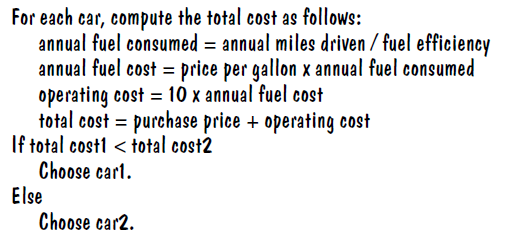

**Langkah 4** Uji pseudocode Anda dengan mengerjakan suatu masalah.

Kami akan menggunakan nilai sampel ini

    Car 1: $25,000, 50 miles/gallon
    Car 2: $20,000, 30 miles/gallon

Berikut adalah perhitungan untuk biaya mobil pertama:

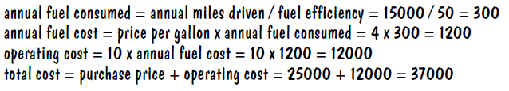

Demikian pula, total biaya untuk mobil kedua adalah $ 40.000. Oleh karena itu, keluaran dari algoritma tersebut adalah
untuk memilih mobil 1.

Contoh Kerja berikut menunjukkan bagaimana menggunakan konsep-konsep dalam bab ini dan langkah-langkah dalam Cara untuk memecahkan masalah lain. Dalam hal ini, Anda akan melihat
bagaimana mengembangkan algoritme untuk meletakkan ubin dalam pola warna yang bergantian. Anda harus membaca Contoh Kerja untuk meninjau apa yang telah Anda pelajari, dan untuk bantuan dalam menangani masalah lain.

Di bab-bab selanjutnya, Contoh yang Dikerjakan disediakan untuk Anda pada pendamping buku Situs web. Deskripsi singkat tentang masalah yang ditangani dalam contoh akan muncul dengan pengingat untuk mengunduhnya dari www.wiley.com/go/bjeo6examples. Anda akan menemukan apapun kode yang terkait dengan Contoh yang Dikerjakan yang disertakan dengan kode pendamping buku untuk bab. Saat Anda melihat deskripsi Contoh yang Dikerjakan, unduh contoh dan kode untuk mempelajari bagaimana masalah tersebut diselesaikan.

### **CONTOH KERJA 1.1**  **Menulis Algoritma untuk Memasang Lantai**

**Rumusan Masalah** 

Tulislah algoritma untuk memasang ubin pada lantai kamar mandi berbentuk persegi panjang dengan ubin hitam putih berselang-seling berukuran 4×4 inci. Dimensi lantai, diukur dalam inci, merupakan kelipatan 4. 

**Langkah 1**   Tentukan input dan outputnya.
Inputnya adalah dimensi lantai (panjang × lebar),
diukur dalam inci. Outputnya adalah lantai keramik.

**Langkah 2**   Memecah masalah menjadi tugas-tugas yang lebih kecil.

selesaikan tugas itu, maka Anda dapat menyelesaikan masalah dengan meletakkan satu baris di samping yang lain, mulai dari dinding, sampai Anda mencapai dinding yang berlawanan.

Bagaimana Anda meletakkan baris? Mulailah dengan ubin di satu dinding. Jika putih, letakkan yang hitam di sebelahnya. Jika berwarna hitam, taruh putih di sebelahnya. Terus berjalan sampai Anda mencapai dinding yang berlawanan. Baris akan berisi lebar / 4 ubin.

**Langkah 3**   Jelaskan setiap subtugas dalam pseudocode.

Dalam kodesemu, Anda ingin lebih tepat tentang di mana tepatnya ubin ditempatkan.

**Langkah 4**   Uji pseudocode Anda dengan mengerjakan suatu masalah.

Misalkan Anda ingin memasang ubin di area berukuran 20 × 12 inci. Langkah pertama adalah menempatkan ubin hitam
di sudut barat laut.

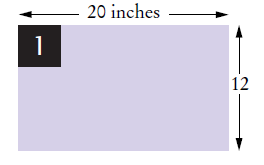

Selanjutnya, bergantian empat ubin sampai mencapai dinding timur. (lebar / 4 – 1 = 20 / 4 – 1 = 4).

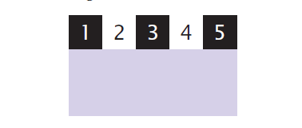

Ada ruang di selatan. Temukan ubin di awal baris yang sudah selesai. Warnanya hitam.
Tempatkan ubin putih di sebelah selatannya.

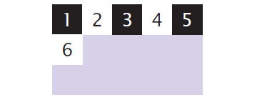

Lengkapi baris.

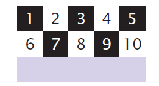

Masih ada ruang di selatan. Temukan ubin di awal baris yang sudah selesai. Dia putih. Tempatkan ubin hitam di selatannya.

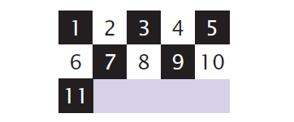

Lengkapi baris.

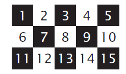

## **RINGKASAN C H A P T E R**
**Definisikan "program komputer" dan pemrograman.**

---
* Komputer menjalankan instruksi yang sangat mendasar secara berurutan.
* Program komputer adalah urutan instruksi dan keputusan.
* Pemrograman adalah tindakan merancang dan mengimplementasikan program komputer.

**Menjelaskan komponen-komponen komputer.**

---
* Unit pemrosesan pusat (CPU) melakukan kontrol program dan data
pengolahan.
* Perangkat penyimpanan termasuk memori dan penyimpanan sekunder.

**Jelaskan proses menerjemahkan bahasa tingkat tinggi ke kode mesin.**

---
* Java awalnya dirancang untuk memprogram perangkat konsumen, tetapi yang pertama
berhasil digunakan untuk menulis applet Internet.
* Java dirancang agar aman dan portabel, menguntungkan pengguna Internet dan
siswa penyok.
* Program Java didistribusikan sebagai instruksi untuk mesin virtual, membuatnya
platform-independen.
* Java memiliki perpustakaan yang sangat besar. Berfokuslah untuk mempelajari bagian-bagian perpustakaan yang Anda
kebutuhan untuk proyek pemrograman Anda.

**Kenali lingkungan pemrograman Java Anda.**

---
* Sisihkan waktu untuk membiasakan diri dengan lingkungan pemrograman yang Anda
akan digunakan untuk tugas kelas Anda.
* Editor adalah program untuk memasukkan dan memodifikasi teks, seperti program Java.
* Java peka huruf besar/kecil. Anda harus berhati-hati dalam membedakan antara upperand
huruf kecil.
* Kompilator Java menerjemahkan kode sumber ke dalam file kelas yang berisi instruksi
untuk mesin virtual Java.
* Kembangkan strategi untuk menyimpan salinan cadangan Anda
bekerja sebelum terjadi bencana.

**Jelaskan blok bangunan dari program sederhana.**

---
* Kelas adalah blok bangunan dasar dari program Java.
* Setiap aplikasi Java berisi kelas dengan metode utama. Ketika aplikasi
dimulai, instruksi dalam metode utama dieksekusi.
* Setiap kelas berisi deklarasi metode. Setiap metode berisi urutan
instruksi.
* Sebuah metode dipanggil dengan menentukan metode dan argumennya.
* String adalah urutan karakter yang diapit oleh tanda petik

**Klasifikasikan kesalahan program sebagai kesalahan waktu kompilasi dan waktu proses.**

---
* Kesalahan waktu kompilasi adalah pelanggaran aturan bahasa pemrograman yang
dideteksi oleh kompiler.
* Kesalahan run-time menyebabkan program mengambil tindakan yang dilakukan programmer
tidak bermaksud.

**Tulis pseudocode untuk algoritma sederhana.**

---
* Sebuah algoritma untuk memecahkan masalah adalah urutan langkah-langkah yang
tidak ambigu, dapat dieksekusi, dan diakhiri.
* Pseudocode adalah deskripsi informal dari urutan langkah
untuk memecahkan suatu masalah.

